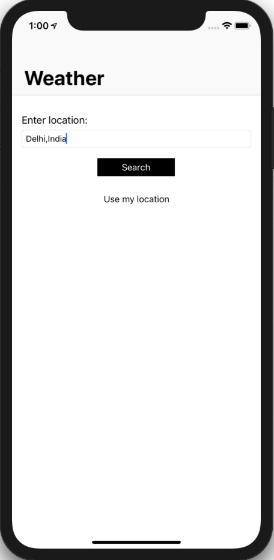

# WeatherApp
### Created By Mohammad Tabrez Ansari
This app show your current location weather and also which city you want to search

## Pod
Open your terminal and use this command
```bash
pod init
```
Edit pod file and paste this code
```bash
pod 'Alamofire', '~> 4.7'
pod 'SwiftyJSON', '~> 4.0'
```
Now open yourProject.xcworkspace

## Info.plist
Give the permission of the location.

## Screenshot
<p>
  
  
</p>

## Get your APIKEY
Go to [open Weather Map](https://openweathermap.org/api) and get your apikey.


